title: Service Worker
author:
  name: I'm Adrien, frontend developer
  url: https://oodrive.com
  email: a.gibrat@oodrive.com
theme: ./theme
controls: false
output: index.html

--


<script type="presenter/text">
I work at Oodrive an international software editor

We create B2B products to securly share, backup & sign documents in the cloud

Our headquarters are in Paris, France

We are also here in Iasi, with a great team of developers called the "Iron Team" (backend, frontend and QA)

Thank you to have invited me and my french accent ;)

Please, bear with me because it's my first talk with such a large audience and also my very first talk in english

Yes, I do like challenge
</script>

--

# Service Worker

## <font color=red>A</font> <font color=green>[gentle]</font> introduction

<script type="presenter/text">
Today I want to make you discover Service worker because it push the web plateform forwards & allows to do pretty cool stuffs!

It's getting more traction every day and it will be available *very soon* in all evergreen browsers

You should have heard about Service Worker

If not, you may have heard about Progressive Web Apps:
It's a web page that try to behave like a native application

Service worker is the core technology that enable this kind of magic ;)
</script>

--

## What is a Worker?

<script type="presenter/text">
But first, lets start with the basics
</script>

--

### Browsers used to run everything in one thread


[🏋 Intensive Javascript](https://developer.mozilla.org/en-US/docs/Tools/Performance/Scenarios/Intensive_JavaScript)

<script>
document.currentScript.parentNode.addEventListener('mermaid', event => event.target.querySelectorAll('g:nth-child(4), line').forEach(e => e.style = 'visibility: hidden!important')) // hide lines
</script>

<script type="presenter/text">
Each document in a browser is a single tread that do a lot of stuffs

Modern Javascript engines are very good to deal with blocking and async executions

But sometimes it blocks render (bad user experience)

side node: links in every slide
</script>

--

### Workers runs Javascript in another thread

```mermaid
sequenceDiagram
	participant B as 🗔 Browser
	participant W as 📃 Worker
	B->>W: create
```



[📓 Worker API](https://developer.mozilla.org/en-US/docs/Web/API/Worker)

<script type="presenter/text">
That's why Worker allows to unload the document thread 
by delegating some heavy work to an independant script

To do so, the main thread creates a new dedicated thread thanks to a worker
</script>

--

### Then uses events to communicate

```mermaid
sequenceDiagram
	participant B as 🗔 Browser
	participant W as 📃 Worker
	B->>W: create
	loop events
		W--xB: message
		B--xW: 
	end
```



[📯 postMessage](https://developer.mozilla.org/en-US/docs/Web/API/Worker/postMessage)

<script type="presenter/text">
Then the worker and the document can communicate through events

Usually messages transit by using postMessage method

It allows to exchange strings and to some extent Objects

(more about this later)
</script>

--

### There are three kind of Workers

> All run background scripts independently of any UI

- Web Workers <small class="fragment">since 2010, perform heavy computation, ex: pdfjs</small>
- Shared Workers <small class="fragment">since 2010, shared across same origin ~~webkit in 2015~~</small>
- Service Workers <small class="fragment">since 2014, control HTTP requests from same origin</small>

[👷 Workers](https://www.w3.org/TR/workers/)

<script type="presenter/text">
-> Each Web Worker is dedicated to its 'parent' thread

-> Shared Worker can communicate with every document from the same orign
They are not deprecated, but they won't gain traction without at least positive signal about better browser support

-> Service worker are also shared across same origin, but have complete different goals and propeties
</script>

--

## Let's talk about Service workers

<script type="presenter/text">
Ok, enough teasing ;)
</script>

--

### Definition

> A service worker acts as a proxy between the browser (your web application) and the network

Main usages
- Offline access

```mermaid
graph LR
	B("🗔") --> S("📃")
    S -.- N("☁")
	style B fill:none,stroke:none
	style S fill:none,stroke:none
	style N fill:none,stroke:none
```

- Push notifications

<li class="fragment">and more...</li>

[📖 Service Worker API](https://developer.mozilla.org/en-US/docs/Web/API/Service_Worker_API)

<script>
document.currentScript.parentNode.addEventListener('mermaid', event => {
	event.target.classList.add('fragment', 'float-right')
	event.target.style.marginTop = '-5rem'
	event.target.style.maxWidth = '60%'
	if (event.target.matches('li:nth-of-type(2) svg')) event.target.style.marginTop = '-8rem'
}) // graphs position
</script>

<script type="presenter/text">
-> Service worker can respond to HTTP requests even when network is down

-> Service worker can recieve push when your web app is not opened in any browser tab or window

The main purpose is offline access, but as a proxy it also enables creative uses, like on-the-fly image generation

Ex: The Guardian used Service Worker to display UK election results per candidates, per distrinct with Push Notification
They composed localy candidate avatar with other graphic information in large images displayed as 'Big Pictures' Push Notification saving up to 100MB on devices with high pixel density

-> We'll see other exiting new usages at the end of the talk
</script>

--

### It uses recent async APIs

support: chrome, mozilla, android, opera, edge, safari

- Promises <small class="fragment">construction to execute code after a task is fulfilled</small>
- postMessage <small class="fragment">method to communicate between contexts</small>
- fetch <small class="fragment">function to make simple HTTP requests, successor of XHR</small>

[✓ Is Service Worker Ready](https://jakearchibald.github.io/isserviceworkerready)

<script type="presenter/text">
-> a Promise is simple abstraction of an asynchronous task

-> postMessage can exchange strings and some Objects (ArrayBuffer, MessageChannel Port or ImageBitmap)

Ownership of the object is transferred, it becomes unusable in the context it came from

-> fetch is really simple to use compared to the bloated XHR Object

It's a function that accepts 2 arguments (URL and options) and return a promise

side note: explain support icons
</script>

--

### Runs under conditions

support: chrome, mozilla, android, opera, edge (development), safari (development)

- HTTPS only, same origin <small class="fragment">for security reason</small>
- No DOM access <small class="fragment">no `document`, nor `window`</small>
- Behind flag <small class="fragment">in Edge & Safari Technical Preview</small>

[❔ Can I Use Service Worker](http://caniuse.com/#search=serviceworker)

<script type="presenter/text">
-> It's also not available in private browsing in Firefox, i guess it's how security is implemented

-> Remember, a worker has no access to UI

The global object is `self`

-> It means you can use service worker in all evergreen browsers today

And start to plan cross browser features based on Service Worker for literally tomorrow
</script>

--

## How to use it?

<script type="presenter/text">
Yeah, I know you'd like to see some code...
</script>

--

### Registration

support: chrome, mozilla, android, opera, edge (development), safari (development)

`main.js`

```javascript
if (navigator.serviceWorker)
	navigator.serviceWorker
		.register('/service-worker.js', { scope: '/' })
		.then(registration => registration.state)
```

<span class="fragment">Multiple Service Workers must register distinct scopes</span>

[🍰 Getting Started](https://developers.google.com/web/fundamentals/getting-started/primers/service-workers)

<script type="presenter/text">
The first thing you need to do is to register your service worker

Provide a script URL, and optional settings
By default the scope is the path of the Service Worker script

The scope is the path on your origin behind which the Service Worker will be active
Like the path for a cookie

-> Multiple Service Workers must register distinct scopes

You may have a SW dedicated to assets with the '/public' scope
And another one dedicated to data requests behind the '/api' scope

In the end, your get a registration Object that gives you access to the state of the Service Worker amongst other things
</script>

--

### First install

support: chrome, mozilla, android, opera, edge (development), safari (development)

`service-worker.js`

```javascript
self.addEventListener('install', event => 
	event.waitUntil(/* ready to activate */)
)
```



```mermaid
graph LR
	P["🗔 page"] -. register .-> I("⚙ install")
    I --> A("✔ activate")
    I --> E("⚠ error")
	style P fill:white
	style I fill:white,stroke:#41b6e8
	style A fill:white,stroke:green
	style E fill:white,stroke:red
```

[⚙ Service Worker Lifecycle](https://developers.google.com/web/fundamentals/primers/service-workers/lifecycle#install)

<script type="presenter/text">
Service Worker nee to be installed because it will run independently of your web application

The `self` keyword is the Service Worker instance

The `waitUntil` method takes a Promise as only argument, it ensure that you can do whatever you need before the Service Worker activates.

ex: prefill the cache, load external, etc
</script>
--

### Next visit

support: chrome, mozilla, android, opera, edge (development), safari (development)

- Activates only inside scope
- Skip the `install` event handler

```mermaid
graph LR
	P["🗔 page"] -. in scope .-> A("✔ activate")
	A -. control .-> P
	click P callback "in the Service Worker Scope"
	style P fill:white,stroke:lightgrey
	style A fill:white,stroke:green
```




[👍 Service Worker: An Introduction](https://developers.google.com/web/fundamentals/primers/service-workers)

--

### Upgrade process

support: chrome, mozilla, android, opera, edge (development), safari (development)

New Service Worker will wait deactivation of the old one before it activates


<script>
document.currentScript.parentNode.addEventListener('mermaid', event => event.target.style.maxWidth = '90%')
</script>

[✌ Service Worker Lifecycle](https://developers.google.com/web/fundamentals/primers/service-workers/lifecycle)

--

### Emitted events

Main functional events

- fetch <small class="fragment">intercepted an HTTP request (made by main thread)</small>
- message <small class="fragment">received a message via postMessage</small>
- push <small class="fragment">received a push notification</small>

[🗱 Service Worker events](https://developer.mozilla.org/fr/docs/Web/API/ServiceWorker)

--

### States & events flow

```mermaid
graph LR
	A("✔ Activated") --> D{"⌛ Idle"}
	D --> F("⚙ Handle event")
	F --> D
    D --> T["☠ Terminated"]
	T --> F
	style A fill:white,stroke:green
	style D fill:white
	style F fill:white,stroke:#41b6e8
    style T fill:white,stroke:red
```


<script>
document.currentScript.parentNode.addEventListener('mermaid', event => event.target.style.maxWidth = '100%')
</script>

<span class="fragment">Service worker may **terminate at any time**!</span>

[🌠 Using Service Workers](https://developer.mozilla.org/en-US/docs/Web/API/Service_Worker_API/Using_Service_Workers)

--

## Avoid pitfalls

--

### Persistence

> You cannot rely on global state within a service worker

- No Local Storage
- But IndexedDB (use a wrapper!)
- Use the Cache interface

[🖥 Localforage](https://www.npmjs.com/package/localforage)

--

### Tips

- Beware of redirects, credentials, streams
- Avoid puting version in script URL
- Specific debug tools <small class="fragment">chrome://serviceworker-internals</small>
- By default first run does not `control` the main Thread


[⚠ Service Workers gotchas](https://medium.com/@boopathi/service-workers-gotchas-44bec65eab3f)

--

## Let's go offline!

--

### Offline basics

support: chrome, mozilla, android, opera, edge (development), safari (development)

`service-worker.js`

```javascript
const CACHE = 'my-awsome-pwa',
const FILES = ['/', '/styles.css', '/script.js']
self.addEventListener('install', event =>
	event.waitUntil(
		caches.open(CACHE)
			.then(cache => cache.addAll(FILES))
	)
)
```

[📚 Service Worker specification](https://w3c.github.io/ServiceWorker/)

--

### Cache first, fallback to network

support: chrome, mozilla, android, opera, edge (development), safari (development)

`service-worker.js` 

```javascript
self.addEventListener('fetch', event =>
	event.respondWith(
		caches.match(event.request)
			.then(response => response || fetch(event.request))
	)
)
```

[📴 Offline cookbook](https://developers.google.com/web/fundamentals/instant-and-offline/offline-cookbook/#cache-falling-back-to-network)

--

### Caching strategies

- Cache only <small class="fragment">KISS Progressive Web Application</small>
- Cache first, falling back to network <small class="fragment">static assets</small>
- Network first, falling back to cache <small class="fragment">API resources</small>
- etc

[🗃 Workboxjs](https://workboxjs.org/)

--

## Receive notifications

--

### Web push notification

- Used to be complex <small class="fragment">vendor specific implementations</small>
- Fully standardized <small class="fragment">browser provides push server</small>
- Native notifications UI <small class="fragment">with user permission</small>

[🚨 Push Notifications in Web App](https://developers.google.com/web/fundamentals/codelabs/push-notifications/)

--

### Subscription

support: chrome, mozilla, android, opera, edge (development), safari (development)

`main.js`

```javascript
const registration = await navigator.serviceWorker.ready
const push = await registration.pushManager.subscribe()
sendToBackend(push.endpoint)
```

`manifest.json` <small>(chrome only)</small>
```javascript
{ ..., "gcm_sender_id": "<Your Sender ID Here>" }
```

[📲 Web Push Notifications](https://developers.google.com/web/fundamentals/codelabs/push-notifications)

--

## And more!

- Background sync <small class="fragment">wait for stable network connection (backoff)</small>
- Periodic background sync <small class="fragment">scheduled synch (in design)</small>
- Background fetch <small class="fragment">HTTP request outlives browser close</small>

[🐶 Background-fetching proposal](https://github.com/WICG/background-fetch)

--

### Thanks!

- Written in [Markdown](https://github.com/adriengibrat/ServiceWorker.md) with [Cleaver](https://www.npmjs.com/package/cleaver)
- Graphs with [Mermaid](https://mermaidjs.github.io/), code with [Highlights](https://www.npmjs.com/package/highlights)
- Theme [Select](https://github.com/select/cleaver-select-theme), icons [UTF8](https://www.utf8icons.com/) with [Symbola](https://fonts2u.com/symbola.font) font
- [Jake Archibald](https://twitter.com/jaffathecake), author/advocate of [specs](https://w3c.github.io/ServiceWorker/)
- [Google developers website](https://developers.google.com/web/fundamentals/getting-started/primers/service-workers) & [MDN](https://developer.mozilla.org/en-US/docs/Web/API/Worker)
- [w3c](https://w3c.github.io/ServiceWorker/) & [whatwg](https://html.spec.whatwg.org/multipage/workers.html)

[👁 Slides links](https://github.com/adriengibrat/ServiceWorker.md/blob/master/README.md)

--


-- 

### Life cycle example

```mermaid
sequenceDiagram
	participant B as 🗔 Browser
	participant W as 📃 Service Worker
	participant S as ➡ Push Server
	B->>W: register
	activate B
	activate W
	W--xB: message
	deactivate W
	B--xW: fetch
	activate W
	deactivate W
	deactivate B
	S--xW: notification
	activate W
	W--xB: 
	deactivate W
```


<script>
document.currentScript.previousElementSibling.style.maxWidth = '85%'
// Fix arrow
document.currentScript.parentNode.addEventListener('mermaid', event => {
	event.target.querySelectorAll('line[stroke-width][marker-end]').forEach((line, index) => index % 2 || (line.x2.baseVal.value -= 5))
})
</script>
